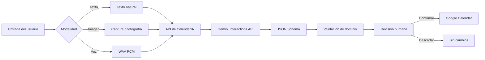

<div align="center">

# CalendarIA

### Convierte lenguaje natural, imágenes y voz en eventos listos para tu calendario.

[](https://github.com/aiirvizionz/CalendarIA/actions/workflows/ci.yml)


**[Abrir CalendarIA](https://calendaria.onrender.com/)**

</div>

---

## El proyecto

**CalendarIA** es una agenda inteligente diseñada para reducir la fricción de crear eventos.

En lugar de llenar formularios campo por campo, el usuario puede escribir una frase, adjuntar una captura o describir un compromiso por voz. Gemini interpreta la entrada, extrae la información relevante y presenta un evento estructurado para revisión antes de enviarlo a Google Calendar.

> “Tengo examen de Redes el próximo martes a las 8 de la mañana.”

```text
Examen de Redes
Martes · 08:00
Categoría: Examen
```

La IA propone. **El usuario confirma.**

---

## ¿Qué problema resuelve?

Crear un evento suele implicar detener lo que estás haciendo, abrir una aplicación y capturar manualmente título, fecha, hora, categoría y recordatorios.

CalendarIA convierte información que ya existe en lenguaje cotidiano en una acción estructurada:

```text
Texto ──────┐
Imagen ─────┼──► Gemini ──► Evento estructurado ──► Revisión ──► Google Calendar
Voz ────────┘
```

El objetivo del proyecto es explorar una experiencia de agenda **multimodal, segura y centrada en revisión humana**.

---

## Experiencia multimodal

### Texto

CalendarIA entiende expresiones naturales y temporales como:

- “Mañana tengo que entregar el proyecto a las 4.”
- “Presentación de IA el viernes a las 9 am.”
- “Estudiar redes el próximo lunes.”

La fecha local y la zona horaria del usuario forman parte del contexto de extracción.

### Imagen

Una captura de horario, tarea o notificación puede convertirse en un evento. El frontend acepta imágenes JPG, PNG y WebP dentro de límites controlados y el backend vuelve a validar el contenido antes de enviarlo a Gemini.

### Voz

La aplicación captura audio mono mediante `AudioWorklet`, genera WAV PCM de 16 bits y envía la grabación para extracción estructurada.

La grabación se limita a 60 segundos y el evento resultante sigue pasando por la misma revisión humana que texto e imagen.

---

## Flujo de producto



---

## Arquitectura

CalendarIA mantiene una separación explícita entre interfaz, dominio, servicios externos y seguridad.

```text
CalendarIA
│
├── Browser
│   ├── app.js                  UI y flujo de interacción
│   ├── api.js                  Cliente HTTP same-origin
│   ├── store.js                Persistencia local versionada
│   ├── media.js                Imagen y captura WAV PCM
│   └── pcm-recorder-worklet.js Procesamiento de audio
│
├── Express API
│   ├── config.js               Configuración de entorno
│   ├── event.js                Dominio y validación
│   ├── session.js              Sesiones y CSRF
│   ├── rate-limit.js           Límites de uso
│   ├── gemini.js               Extracción multimodal
│   └── google.js               OAuth y Calendar API
│
├── Google Gemini
│   └── Interactions API
│
└── Google Calendar
    └── Events API
```

El frontend se mantiene en **Vanilla JavaScript modular**. La decisión es intencional: el proyecto no necesita un framework de componentes para resolver su complejidad actual y evita añadir una capa de abstracción sin beneficio funcional directo.

---

## IA con salida estructurada

El navegador nunca decide las instrucciones privilegiadas del modelo.

El prompt de sistema pertenece al backend y Gemini recibe una tarea limitada: extraer un único evento.

La respuesta se restringe mediante JSON Schema:

```json
{
  "titulo": "Presentación final",
  "fecha": "2026-12-01",
  "hora": "09:00",
  "categoria": "presentacion"
}
```

Después de Gemini, CalendarIA aplica una segunda capa de validación sobre:

- título;
- fecha real de calendario;
- hora de 24 horas;
- categorías permitidas;
- recordatorios permitidos.

La aplicación configura las interacciones con `store: false` y mantiene el principio de **human-in-the-loop**: ningún resultado generado por IA se agenda automáticamente.

---

## Seguridad por diseño

CalendarIA fue endurecido pensando en exposición pública.

### Protección de Gemini

- El cliente no puede proporcionar ni reemplazar el system prompt.
- El endpoint de IA requiere una sesión autenticada.
- Las solicitudes requieren CSRF token.
- Existen límites adicionales por usuario e IP.
- Imagen y audio utilizan allowlists de MIME y límites de tamaño.
- La salida del modelo se valida nuevamente en el dominio.

### OAuth y Google Calendar

El flujo utiliza **OAuth 2.0 Authorization Code + PKCE**.

```text
Browser
   │
   ▼
CalendarIA backend
   │
   ├── state aleatorio
   ├── PKCE verifier
   └── redirect a Google
            │
            ▼
      Google Authorization
            │
            ▼
      Authorization Code
            │
            ▼
CalendarIA backend
   │
   ├── intercambio de código
   ├── access token
   └── refresh token
```

Los access tokens y refresh tokens permanecen en el servidor. La cookie del navegador contiene únicamente un identificador de sesión aleatorio firmado mediante HMAC.

El estado temporal de OAuth se cifra y autentica con AES-256-GCM.

### Hardening HTTP

La API incorpora:

- Content Security Policy estricta;
- HSTS en producción;
- `X-Content-Type-Options: nosniff`;
- protección contra framing;
- Referrer Policy;
- Permissions Policy;
- Request IDs;
- errores 5xx sanitizados;
- timeouts para servicios externos;
- límites de tamaño de request.

Los datos dinámicos se renderizan con APIs DOM seguras y no mediante `innerHTML` con contenido procedente del usuario o del modelo.

---

## Sincronización de eventos

Cada evento local mantiene un estado explícito:

```text
local
syncing
synced
failed
```

Los eventos sincronizados conservan el `googleEventId` devuelto por Calendar API.

Al eliminar un evento sincronizado, CalendarIA intenta borrar primero la copia remota. La copia local solo se elimina después de recibir confirmación de Google, evitando mostrar una eliminación falsa cuando existe un fallo de red o de autorización.

---

## Persistencia local

Los eventos se almacenan en un esquema local versionado:

```json
{
  "version": 2,
  "events": []
}
```

CalendarIA incluye migración para datos creados por versiones anteriores del proyecto, validación de registros almacenados y recuperación segura ante JSON corrupto.

Los identificadores locales utilizan `crypto.randomUUID()`.

---

## Stack tecnológico

| Capa | Tecnología |
|---|---|
| Frontend | HTML5, CSS, Vanilla JavaScript ES Modules |
| Backend | Node.js 24, Express |
| Inteligencia artificial | Gemini Interactions API |
| Salida de IA | JSON Schema + validación de dominio |
| Autorización | Google OAuth 2.0 + PKCE |
| Calendario | Google Calendar API |
| Audio | Web Audio API, AudioWorklet, WAV PCM |
| Persistencia | localStorage versionado + sesión server-side |
| CI | GitHub Actions |
| Deploy | Render |

---

## Calidad de código

El repositorio incluye pruebas con `node:test` y validación sintáctica automatizada.

La cobertura funcional actual contempla:

- fechas reales y años bisiestos;
- horas válidas en formato de 24 horas;
- categorías y recordatorios permitidos;
- cálculo de fin de evento sin mezclar UTC con hora local;
- validación secundaria de respuestas de IA;
- MIME y Base64 multimedia;
- extracción de `model_output` desde Interactions API.

GitHub Actions valida cada Pull Request y los cambios de `main` sobre Node.js 24.

---

## Decisiones de ingeniería

### ¿Por qué no React?

La interfaz es una aplicación compacta con un conjunto limitado de estados y vistas. ES Modules permiten separar responsabilidades sin introducir bundle, runtime de framework o tooling adicional.

### ¿Por qué revisión humana?

Fechas y horas son datos sensibles a ambigüedad lingüística. CalendarIA trata la IA como un extractor asistido, no como una autoridad final.

### ¿Por qué sesiones server-side?

Los tokens OAuth no deben quedar disponibles para JavaScript del navegador. El servidor conserva las credenciales y el cliente únicamente mantiene un identificador de sesión firmado.

### ¿Por qué un modelo de evento propio?

Separar el evento de dominio del recurso de Google Calendar permite validar, migrar y evolucionar CalendarIA sin acoplar toda la aplicación al formato de una API externa.

---

## Estado del proyecto

**CalendarIA 2.0** representa la evolución del MVP inicial hacia una arquitectura preparada para exposición pública en una única instancia de aplicación.

### Implementado

- [x] Creación manual de eventos
- [x] Extracción mediante texto
- [x] Análisis de imágenes
- [x] Captura y análisis de voz
- [x] Revisión humana de eventos generados
- [x] OAuth 2.0 + PKCE
- [x] Integración con Google Calendar
- [x] Refresh de tokens
- [x] Eliminación remota consistente
- [x] Rate limiting
- [x] CSRF
- [x] CSP y hardening HTTP
- [x] Persistencia local versionada
- [x] Tests y CI
- [x] Interfaz responsive

### Próximos retos

- [ ] Persistencia multi-dispositivo
- [ ] Sincronización bidireccional con Google Calendar
- [ ] Edición de eventos sincronizados desde la interfaz
- [ ] Redis para sesiones y rate limiting distribuido
- [ ] Métricas y observabilidad
- [ ] PWA y experiencia offline

---

## Autor

**David Alejandro Lopez Huerta**  
Estudiante de Ingeniería en Sistemas · FIME, UANL

Proyecto enfocado en integración de IA multimodal, desarrollo web y diseño seguro de servicios públicos.

[GitHub @aiirvizionz](https://github.com/aiirvizionz)

---

<div align="center">

**CalendarIA · La IA propone. Tú decides qué entra a tu calendario.**

</div>
